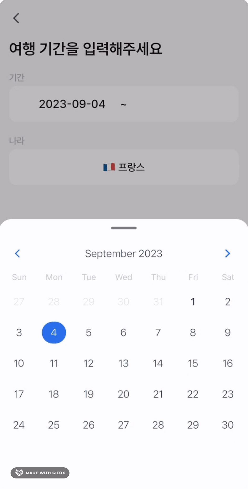

# react-native-animated-form-stack


## Introduction
Have you ever wondered about creating a component like this? Or have you ever seen such a UI and wished you could implement it effortlessly?



What if just wrapping your existing Form UI with our component could achieve this effect? No need for any additional external libraries; the ones you're already using in your project are sufficient.

Experience the magic of animated forms in a lightweight package of just under 2 KB.

## Install

```bash
yarn add react-native-animated-form-stack
```

## Usage

### 1. Wrap `FormStack`

By simply wrapping your filed UI with `FormStack`, you will receive a dynamic form that automatically calculates steps based on the arrangement of the fields and applies dynamic effects.

```tsx
import { FormStack, IFormStackRef } from 'react-native-animated-form-stack';

const Example = () => {
    const formStackRef = useRef<IFormStackRef>(null);
    // You can obtain a step whenever it updated
    const [step, setStep] = useState(0);
    
    return (
        <FormStack ref={formStackRef} onUpdate={setStep}>
            {/* just place your form here! */}
            <YourField />
            <YourField />
            <YourField />
        </FormStack>
    ) 
}
```

### 2. Call the functions to handle step

Now, you can handle the step of `StackForm` by calling the methods of it; `prev()`, `next()`

```diff
import { FormStack, IFormStackRef } from 'react-native-animated-form-stack';

const Example = () => {
    const formStackRef = useRef<IFormStackRef>(null);
    // You can obtain a step whenever it updated
    const [step, setStep] = useState(0);
    
+    const handlePressPrev = () => {
+        // Show previous step of field
+        ref.current?.prev();
+    };

+    const handlePressNext = () => {
+        // Show a next step of field
+        ref.current?.next();
+    };
    
    return (
        <FormStack ref={formStackRef} onUpdate={setStep}>
            {/* just place your form here! */}
            <YourField />
            <YourField />
            <YourField />
        </FormStack>
    ) 
}
```

## Contribute


This library is used in real-world products, and your contributions can help us make great updates to products uploaded
to the App Store and Play Store.

Download [Apple App Store](https://apps.apple.com/kr/app/zoop-%ED%95%B4%EC%99%B8%EC%97%AC%ED%96%89-%EA%B0%80%EA%B3%84%EB%B6%80/id6447391288) or [Google Play Store](https://play.google.com/store/apps/details?id=com.zoop.app),
a budgeting app for international travelers, today.

## License

[MIT licensed.](https://github.com/zoop-studio/react-native-numberpad/blob/main/LICENSE)
